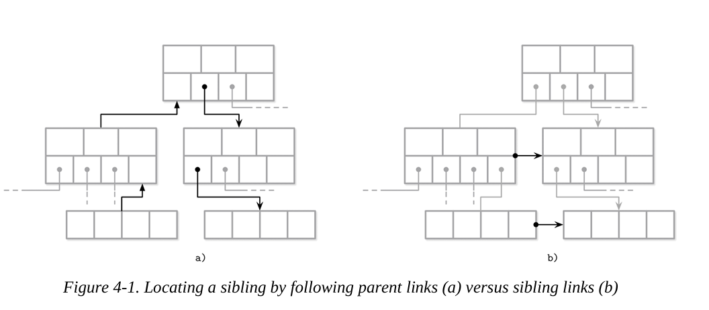

# 고급 백엔드 스터디 6주차

# Chapter 4. Implementing B-Trees

## 지난 장 복습

지난 장에서는 바이너리 포맷 구성의 일반 원칙과 셀을 생성하고 계층 구조를 구축하며, 이를 포인터를 사용해 페이지에 연결하는 방법을 배웠다. 나는 이번 주차부터 스터디에 합류하였기 때문에, 이에 대해 간단히 정리해보려고 한다. 

바이너리 포맷 구성의 일반 원칙이란 데이터베이스가 디스크나 메모리에 데이터를 저장할 때 효율성과 일관성, 확장성을 유지하기 위해 사용하는 기본 설계 규칙을 말한다. 이 원칙들은 데이터의 구조적 표현을 정하고, 이후 다양한 저장 구조(B-Tree, LSM-Tree 등)에 적용된다.

- 주요 원칙
    - 셀(Cell) 기반 구성
       - 셀은 데이터의 최소 단위로, 일반적으로 (키, 값) 쌍으로 구성된다.
       - 각 셀은 크기 정보, 키, 값 순서로 바이너리 형태로 저장되며, 고정 또는 가변 길이로 설계될 수 있다.
       - 예시: [KeyLength][Key][ValueLength][Value]
    
    - 계층 구조(Hierachy)
        - 데이터는 셀들의 집합으로 페이지(Page)를 구성하고, 페이지들이 모여 블록이나 노드가 된다. 
        - 이 구조는 나무(Tree) 형태의 인덱스(B-Tree, LSM Tree 등)를 만들 때 쓰이며, 상위 노드는 하위 노드나 페이지를 가리키는 포인터를 포함한다.

    - 포인터 연결(Pointer-based linking)
        - 페이지나 셀 간의 참조 관계는 포인터(실제 주소 또는 오프셋 값)로 연결된다.
        - 이를 통해 검색, 삽입, 삭제 시 필요한 경로 탐색이 빠르게 수행된다.
        - 예: 내부 노드가 리프 페이지를 가리키는 구조

    - 페이지 단위 관리
        - 디스크 접근은 블록(보통 4KB~16KB) 단위로 이루어지므로, 셀은 이 단위 내에서 배치된다. 
        - 페이지에는 일반적으로 헤더(Header)가 있으며, 그 안에:
            - 페이지 타입(리프/내부)
            - 셀 수
            - 여유 공간 오프셋
            - 다음 페이지 포인터 등의 메타데이터가 포함된다.

    - 정렬 vs 비정렬
        - 셀들을 키 기준으로 정렬된 상태로 저장하면 범위 탐색(range query)이 효율적이다.
        - 반대로 비정렬/삽입 순서대로 저장하면, 쓰기 성능이 좋고, 컴팩션 등을 통해 나중에 정렬이 가능하다.
        
    - 고정 길이 vs 가변 길이
        - 고정 길이 포맷은 오프셋 계산이 빠르지만 공간 낭비 가능성이 있다. 
        - 가변 길이 포맷은 공간 효율성이 높지만, 인덱싱이나 파싱이 더 복잡하다.
        실생활 비유:
            - 액셀 파일을 저장한다고 가정하면, 각 셀은 하나의 데이터 항목이고, 한 페이지는 시트의 한 구역이며, 포인터는 셀 간 하이퍼링크처럼 작동한다.

이러한 구성 원칙은 B-Tree나 LSM Tree 같은 복잡한 저장 구조에서도 근간이 된다. 즉, 바이너리 레벨에서 일관되고 예측 가능한 구조를 가지도록 설계함으로써, 다양한 작업(탐색, 삽입, 삭제, 복구 등)이 신뢰성있고 빠르게 수행될 수 있도록 하는 것이다.

## 이번 장의 목표

B-Tree 구조에 특화된 구현 및 최적화 기법을 이해하는 데 초점을 둔다. 

- 이 장의 구성은 세 가지 논리적 그룹으로 나뉜다.
    - 조직화(Organization): 키와 포인터 간의 매핑 및 페이지 간 링크 관리
    - 트리 탐색 과정(Root-to-leaf traversals): 이진 탐색, 부모 노드 추적 등을 다룬다.
    - 최적화 및 유지 관리: 노드 리벨런싱, 대량 데이터 로딩, 가비지 컬렉션 기법

이는 B-Tree 내부 동작을 실제로 구현하거나 분석할 때 필요한 기초적이고 실용적인 구조적 이해를 다지는 데 매우 중요한 구성이다.

## Page Header

### Page Header

- 페이지 헤더: 디스크나 메모리 페이지 상단에 위치하며, 해당 페이지의 메타 정보를 담은 관리용 데이터 구조이다.

- 주요 구성 요소:
    - 플래그(flags): 페이지가 리프인지, 내부 노드인지, 어떤 구조를 사용하는 지 등을 식별
    - 셀 개수: 페이지에 포함된 데이터 셀(레코드)의 수
    - 하단/상단 오프셋: 가용 공간의 위치를 가리켜, 새로운 셀을 어디에 배치할 지 판단하는 데 사용
    - 기타 메타데이터: 페이지 레벨(B-Tree 높이), 레이아웃 버전, 페이지 크기 등

- DBMS별 구현 차이:
    - PostgreSQL: 표준적인 페이지 정보(크기, 버전)
    - MySQL InnoDB: 트리 구조 관련 정보(레벨), 힙 구조 관련 카운트
    - SQLite: 셀 개수 외에도 오른쪽 포인터 포함(B-Tree에서 오른쪽 자식 페이지 연결용)

- 비유: 페이지 헤더는 책의 목차나 장표 상단의 정보란처럼, 해당 내용이 어떤 성격을 가지며 어떻게 읽어야 할 지를 미리 알려주는 요약 정보이다.

페이지 헤더는 탐색 속도 향상, 공간 최적화, 장애 복구 등 다양한 기능의 기초가 되는 필수 구조이다.

### Magic Numbers

- 매직 넘버: 
    - 특정 파일이나 페이지의 시작 부분에 저장된 **고정된 값(식별자)**으로, 해당 구조의 종류, 포맷, 버전 등을 판별하는 데 사용된다.
    - 일반적으로 사람이 알아보기 쉬운 ASCII 코드의 16진 표현을 많이 사용한다. 
        - 예: PAGE -> 50 41 47 45

- 사용 목적: 
    - 유효성 검사(validation): 올바른 구조인지 판단
    - 정합성 확인(sanity check): 파일 또는 페이지의 시작 위치가 잘못 지정되어있는지 확인
    - 포맷 식별: 어떤 종류의 페이지인지 구분

- 실제 동작 예시:
    - 쓰기(write): 페이지 헤더에 PAGE에 해당하는 매직 넘버를 저장
    - 읽기(read): 해당 위치의 4바이트를 읽어서 매직 넘버와 일치하는지 비교

- 비유: 여권 첫 장에 있는 국가 코드 및 사진처럼, 구조물의 정체성을 증명하는 태그 역할

매직 넘버는 특히 시스템 충돌 후 복구, 포맷 자동 식별, 디버깅 등에서 매우 유용한 안전장치이다.

### Sibling Links

- 형제 링크:
    - 트리 구조에서 같은 레벨에 위치한 노드들(형제 노드)을 서로 연결하는 포인터
    - **왼쪽 형제 링크(backward link)**와 **오른쪽 형제 링크(forward link)**로 구성된다.

- 사용 목적:
    - 이웃 노드를 찾을 때 부모 노드를 거치지 않고 직접 이동이 가능하다.
    - 범위 탐색(range scan), 인접 데이터 조회 등에 유리하다.

- 비유:
    - 엘리베이터가 없는 건물에서, 같은 층 방끼리 복도로 연결된 문이 있는 셈
    - 복도가 없으면 계단을 타고 내려갔다가 다시 올라가야 하는 불편함과 유사하다.

- 실용적 장점:
    - 이웃 노드 접근이 빠르다.
    - 트리 탐색 경로의 최적화가 가능하다.

- 그림 해설
    - (a) 부모 링크를 따라가는 방식
        - 현재 노드의 형제를 찾기 위해 상위 노드(부모 노드)로 역추적 하여,
        - 부모에서 해당 형제를 가리키는 포인터를 찾아 다시 내려온다.
        - 경우에 따라 루트까지 올라갔다가 다시 내려오는 비효율이 발생 가능하다.

    - (b) 형제 링크가 있는 경우
        - 현재 노드의 헤더에 포함된 형제 포인터를 사용해,
        - 바로 오른쪽(또는 왼쪽) 노드로 이동 가능하다.
        - 탐색 비용 최적화 및 빠른 범위 질의가 가능하다.

- 형제 링크 유지의 어려움
    - 노드 A와 노드 B가 형제 링크일 때, A를 분할하거나 병합할 경우, 노드 B의 포인터도 함께 수정해야 일관성이 유지된다.

    - 하지만 B는 분할/병합의 주체가 아닌 외부 노드이기 때문에,
        - 이 노드를 별도로 수정하고 락을 걸어야 한다.
        - 이로 인해 성능 저하나 병목 현상이 생길 수 있다.

    - 동시성 환경에서의 복잡성
        - 여러 스레드가 동시에 트리를 수정할 수 있는 환경에서는
            - 서로 다른 노드에 락을 걸다 충돌하거나
            - 형제 노드를 동시에 수정하려다 데드락(deadlock) 가능성도 있다.
        
        - 따라서 단순한 형제 링크는 병행성 처리에 어려움을 줄 수 있다.

- Blink-Tree에서의 해결
    - Blink-Tree는 이 문제를 해결한 구조이다.
        - 형제 링크를 활용하여 재시도 없이 낙관적 접근(optimistic concurrency) 가능
        - 락 없이도 정합성 유지
        - 성능과 병행성 모두를 만족시킨다.

### Rightmost Pointer

- 구분 키(seperator key)
    - 노드 내에서 키 값의 범위를 구분해주는 키
    - 각 키는 어떤 구간의 값을 어떤 자식 노드로 보낼 지 결정한다.

**Counting Keys**에서 언급된 **+1의 의미**: 예를 들어, 노드에 K1, K2, K3라는 키가 있을 때 이 구분 키들이 만드는 구간은 4개이다. 따라서 키가 3개이면 자식 포인터는 4개가 필요하다. 이것이 +1이다. 항상 자식 포인터는 키 수 + 1만큼 필요하다.

- 구분 키의 불변 조건(seperator key invariants)
    - 각 구분 키는 값의 범위를 나누는 기준 점으로 사용된다.
    - 각 구분 키는 왼쪽 구간에 해당하는 자식 노드를 가리키는 포인터와 함께 존재해야 한다. 
    - 예를 들어, 키 K1은 값 < K1의 범위를 P0 포인터로 연결하는 기준 역할이다.

위 그림 4-2를 보면 키 K1, K2, K3는 각 키 앞에 하나씩 포인터가 존재한다.(P0, P1, P2)
하지만 마지막 포인터 P3은 K3 이상의 범위를 위해 필요하지만, 직접 연결된 키가 없다. 
따라서 이 **오른쪽 끝 포인터(rightmost pointer)**는 별도로 저장한다.

- 추가 포인터의 저장 위치
    - 일반적인 키-포인터 쌍으로 저장하기 어려운 오른쪽 끝 포인터는,
    - **페이지 헤더(header)**에 따로 저장하는 구현이 많다. SQLite도 이 방식을 사용한다.

오른쪽 자식 노드가 분할되고, 새로운 셀이 부모 노드에 추가된다면, **오른쪽 자식 포인터는 다시 지정**되어야 한다. 그림 4-3을 보면, 분할 이후 부모 노드에 추가된 셀(회색으로 표시)은 **승격된 키(promoted key)**를 포함하고, 분할된 기존 노드를 가리킨다. 이전의 오른쪽 포인터 대신, 새롭게 생성된 노드를 가리키는 포인터가 할당된다. SQLite에서도 설명되고 구현되어 있다.

- 그림 4-3 설명
    - Before Split:
        - 하위 노드(자식 노드)가 데이터로 가득 찼다(K3, K4, K5).
        - 이 자식 노드를 두 개로 분할 작업을 하려는 상태

    - After Split:
        - 노드가 꽉 차있는데 K6을 추가하려고 하면 들어갈 공간이 없다.
        - 이 경우 노드를 반으로 나눠야 한다. -> 분할(Split)
        - 중간 키(K4)가 부모 노드로 승격(promoted)된다.
        - 기존 노드는 왼쪽 절반만 유지하고, 나머지 키들은 새로운 오른쪽 노드로 이동한다. 
        - 이제 부모 노드는 K3, K4라는 키를 가지고 있다. 

### Node High Keys

일반적인 B-Tree에서는 rightmost pointer가 페이지 헤더 등 노드 바깥에 따로 저장된다. 
하지만, 이 문단에서는 포인터와 high key를 한 셀안에 묶어서 저장한다. 

- High Key란?
    - 한 노드가 자식 노드를 가리킬 때, **그 자식 아래에 존재할 수 있는 값의 최대치**를 함께 표시해주는 키이다.
    - 예를 들어, 어떤 자식 노드가 [40,50] 값을 가진다면, 부모 셀에 High Key = 50 같은 식으로 명시한다.

이 방식은 PostgreSQL에서 사용되며, 이를 Blink-Tree라고 부른다.

B-Tree는 N개의 키(Ki)와 N+1개의 포인터(Pi)를 갖는다. 각 하위 트리에서 키들은 Ki-1 ≤ Ks < Ki의 범위로 제한된다. 이 때, **K0 = −∞**는 암묵적으로 존재하며, 노드에는 실제로 저장되지 않는다.

- **K0 = −∞**가 암묵적인 이유:
    - 트리의 가장 왼쪽 경계값은 모든 값보다 작은 가상의 값으로 취급한다.
    - 그래서 실제 노드에 K0이라는 값은 존재하지 않는다. 
    - 하지만 탐색 규칙을 명확히 표현하기 위해 수학적으로 표기해둔 것이다.

Blink-Tree는 각 노드에 KN+1 키를 추가한다. 이 키는 포인터 **PN이 가리키는 하위 트리**에 저장될 수 있는 키들의 상한선을 지정하며, 현재 하위 트리에 저장될 수 있는 값들의 상한선이 된다. 그림 4-4의 (a)는 high key가 없는 노드, (b)는 high key를 포함한 노드를 나타낸다.

- high key 사용 이유:
    - 트리 탐색 중, 어떤 키가 PN 포인터 범위 안에 포함되는지 아닌지를 판단하기 위함이다.
    - 특히 동시성 환경에서 누군가가 데이터를 옮기거나 분할하는 중일 때, 탐색이 오른쪽 노드로 안전하게 넘어갈 수 있는지 판단하는 기준점이 필요하다. 
    - 예를 들어, [20 | 50]이라는 기존 B-Tree에서 P2는 50보다 큰 값들을 담당하지만, 정확히 어디까지 커도 되는 지 모른다. 하지만 [20 | 50 | **90**]이면 50~90사이만 이 노드가 책임진다는 것을 명시할 수 있다.

이 경우 포인터는 **쌍(pairwise)**으로 저장될 수 있으며, 각 셀이 하나의 대응되는 포인터를 가질 수 있다. 이로 인해 rightmost pointer 처리가 더 단순해질 수 있는데, 이는 고려해야 할 예외적인 상황(edge case)가 줄어들기 때문이다. 

- 쌍으로 지정된 포인터란?
    - 기존에는 [K1, K2, K3] 키, [P0, P1, P2, P3] 포인터 (+1)
    - 이 방식에서는 각 셀마다 키 + 포인터 쌍으로 저장한다.
        - [K1|P1], [K2|P2], [K3|P3] + high key
        - 마지막에 별도 rightmost pointer가 필요 없거나 단순 처리가 가능하다. 
        - 포인터와 셀이 1:1 대응하므로 구현이 쉽다. 

그림 4-5에서는 두 가지 방식의 **페이지 구조 개요도**를 볼 수 있다. 이들이 어떻게 **탐색 공간**을 다르게 분할하는 지도 확인할 수 있다.
- 첫 번째 방식은 +∞까지 올라간다.
- 두 번째 방식은 K3의 상한(upper bound)까지만 올라간다.

### Overflow Pages

- Node Size: 한 노드(= 한 페이지)의 최대 크기 (예: 4KB)
- Fanout: 한 노드가 가질 수 있는 자식 노드 수(보통 키 수 + 1)
-> 이 값들은 고정되어 있어서, 트리 구성 중 유연하게 조정되지 않는다.

- 문제점:
    - 너무 큰 값이 들어오면
        - 셀 하나가 너무 커진다 -> 페이지에 몇개 못들어간다.
        - 예: 각 셀이 2KB이면 4KB 페이지에 딱 2개만 저장 가능
    - 너무 작은 값이 들어오면
        - 셀들이 너무 작으면 페이지 구조 상 빈 공간이 남는다.
        - 예: 10바이트짜리 셀이 200개 들어갈 수 있지만 구조상 100개만 들어간다.

고정된 노드 크기/포맷은 다양한 값 크기에 대응하기 어렵다. 그래서 너무 큰 값은 페이지에서 분리해서 따로 저장하는 방식이 필요하다. 이것이 바로 Overflow Pages의 개념이다.

- B-Tree의 전제 조건
    - 노드는 항목 개수 기준으로 꽉 찼는 지를 판단한다. (예: 4개 이상이면 분할)
    - 하지만 현실에선 각 항목(셀)의 실제 크기가 다를 수 있다.

이때문에 노드에 들어간 항목 수는 기준보다 적어서 분할 조건이 아닌데, 페이지는 실제 저장 공간 부족으로 저장이 불가할 수 있다.
즉, 논리적으로는 **비어있지만**, 물리적으로는 **꽉 차있다**.

위 문제는 해결이 어렵다. 페이지는 보통 4KB, 8KB와 같은 고정 크기 블록이다. 이를 키우려면 새 페이지 할당, 기존 데이터 복사, 메타데이터 수정 등이 필요한데, 이는 매우 번거롭고 성능 저하를 초래할 수 있다.

이때 필요한 게 바로 **오버플로우 페이지**이다. 
기존 페이지가 꽉 찼을 때, 큰 값을 다른 페이지에 따로 저장하고, 원래 자리에는 포인터만 남겨두는 방식이다. 

- 문제점
    - 값의 크기가 클 경우 한 페이지(예:4KB)에 다 못들어간다.
    - 그렇다고 페이지를 통째로 복사하기는 비효율적이다.

- 해결 방법: 연결된 페이지 구조
    - 원래 노드(= 페이지)가 꽉 차면:
        - 추가 4KB짜리 확장 페이지 할당
        - 기존(primary) 페이지에 포인터를 두고 연결
        - 이 확장된 페이지들이 **오버플로우 페이지**

대부분의 B-Tree 구현에선 하나의 B-Tree 노드 안에 저장할 수 있는 payload(데이터 본문)의 바이트 수를 고정된 값으로 제한하고, 그 나머지는 오버플로우 페이지에 저장할 수 있도록 허용한다. 고정된 payload 크기는 노드 크기를 fanout으로 나누어 계산한다.

- payload: 셀에 저장되는 실제 데이터 내용
- 하나의 노드(페이지)에 너무 큰 데이터를 다 넣는건 위험하므로 일정 부분만 넣고 나머지는 오버플로우 페이지로 분리.

- max_payload_size = node size / fanout
- 예: 페이지가 4KB, fanout이 100이면 각 셀에 최대 40바이트까지만 payload를 허용
- 이 값을 넘는 데이터는 오버플로우 페이지로

- 장점
    - 페이지가 항상 일정 부분 비워진다. 이는 구조 안정성 유지로 이어진다.
    - 페이지 공간 고갈 문제 방지
    - 각 셀의 크기를 제어 간으

SQLite에서의 오버플로우 페이지에 대한 더 많은 정보는 SQLite 소스 코드 저장소에서 확인이 가능하다.
MySQL InnoDB 문서도 참고할 수 있다. 

삽입되는 payload가 max_payload_size를 초과하는 경우, 해당 노드에 이미 연결된 오버플로우 페이지가 있는 지를 확인한다. 만약 오버플로우 페이지가 이미 존재하고, 충분한 여유 공간이 있다면, payload의 초과 바이트는 거기에 저장된다. 그렇지 않을 경우엔 새로운 오버플로우 페이지를 할당한다. 

- 그림 4-6 설명
    - 두 개의 레코드 payload1, payload2가 있다.
    - 두 레코드 모두 max_payload_size를 초과, 오버플로우 페이지에 저장된다.
        - primary page에 payload1과 payload2의 일부가 저장됨.
        - 나머지는 오버플로우 페이지에 저장된다.
        - primary page에서 포인터로 overflow page를 연결한다.

- 오버플로우 페이지는 추가적인 관리가 필요하다.
    - 오버플로우 페이지는 큰 값을 나눠 저장하는 공간이다. 
    - 시간이 지나며 어떤 값이 삭제되거나, 값 크기가 줄거나, 페이지 일부만 쓰이는 상황이 발생할 수 있다.
    - 이로 인해 공간이 낭비되거나, 파편화(fragmentation) 발생

- 필요한 관리 작업(bookkeeping)
    - 단편화된 공간 파악
    - 재사용 가능한 공간인지 확인
    - 필요 시, 기존 페이지 재사용 및 페이지 폐기

이러한 작업 없으면 디스크 공간이 계속 낭비되고, 성능 저하와 디스크 사용량 증가의 원인이 된다.

예를 들어, 큰 문자열 값을 저장하기 위해 오버플로우 페이지가 2개가 연결됐다. 나중에 해당 값을 삭제하거나 짧은 값으로 갱신하면 오버플로우 페이지는 그대로 남아있다. 이는 공간 낭비로 이어진다.
따라서 이 페이지는 더 이상 필요 없다 판단하고 회수(discard)해야 한다.

- primary page는 overflow page의 위치를 **page ID**로 기억한다.
- page ID는 디스크 상에서 특정 페이지를 가리키는 주소 같은 것이다.
- overflow page가 여러 개일 경우, 이전 overflow page의 header에 다음 페이지의 ID를 저장한다.

- 어떤 payload가 overflow로 spill된 경우,
    - primary page에서 첫 overflow 페이지 ID를 가져온다.
    - 이어서 overflow page 1, 2, 3...을 순차적으로 따라가며 payload를 조립한다.
- 즉, **여러 페이지를 순회(traverse)**해야 한다.

**키(key)는 보통 높은 카디널리티(high cardinality)**를 가지므로, 키의 일부분만 저장하는 것은 합리적이다. 

- High cardinality: 키의 값이 매우 다양하다는 뜻(예: 주민번호, 이메일 주소, 주문 번호 등)

- 키 전체가 클 수 있다. 예를 들면, 긴 문자열, 복합 키 등이 있다.
- 이를 전부 primary page에 넣기엔 공간이 낭비된다. 
- 따라서 일부만 primary page에 저장하고 나머지는 overflow page에 저장 가능하다.
- 비교(search) 시에는 앞부분만 보고도 충분히 구별 가능하므로 효율적이다. 

데이터 레코드의 경우, 사용자에게 반환하기 위해 해당 레코드의 오버플로우 부분을 찾아야한다.
하지만 이는 자주 발생하는 작업이 아니기 때문에 큰 문제가 되지 않는다.
모든 레코드가 overflow에 있지는 않다. 대부분의ㅔ 경우 primary page에 있는 값이면 충분하다.
하지만 모든 데이터 레코드가 너무 크다면, **큰 값을 위한 특수한 BLOB 저장소(blob storage)**를 사용하는 것이 좋다.

- BLOB Storage란?
    - BLOB = Binary Large Object
    - 큰 텍스트, 이미지, 영상 등을 저장하기 위한 전용 스토리지 영역
    - 일반 B-Tree보다 훨씬 효율적으로 대용량 데이터 저장 가능
    - 예: SQLite는 external overflow page, MySQL InnoDB는 off-page storage를 사용한다.

## Binary Search

### Binary Search

우리는 이미 **B-Tree 탐색 알고리즘**에 대해 다뤘다. 탐색하려는 키는 노드 내에서 이진 탐색 알고리즘을 사용하여 찾는다. 이진 탐색은 정렬된 데이터에만 동작한다.   

- B-Tree 탐색 핵심
    - B-Tree의 각 노드는 여러 개의 키를 갖는다.
    - 이 키들은 항상 정렬된 상태여야 한다.
        - 왜냐하면 이진 탐색은 정렬된 배열에서만 동작한다.
        - 시간 복잡도는 O(log n)으로 매우 효율적이다.
        - B-Tree 노드 내 탐색은 항상 이진 탐색으로 진행된다.

따라서 키를 정렬된 상태로 유지하고(sorted invariant 유지) 정렬 조건을 유지하는 것이 필수적이다.

- 정렬 유지 = Sorted Invariant
    - 삽입/삭제 시에도 항상 키를 정렬된 상태로 유지해야 한다.
    - 이를 깨뜨리면 B-Tree 전체 성능이 무너진다.
    - 정렬 유지는 B-Tree의 기본 규칙(invariant) 중 하나이다.

이진 탐색 알고리즘은 정렬된 항목들의 배열과 탐색할 키를 입력받고, 숫자 하나를 반환한다.

- 반환값 의미
    - 양수: 탐색 키 존재 -> 해당 인덱스 위치
    - 음수: 탐색 키 없음 -> 삽입 지점은 ~(반환값)으로 계산
        - ~는 bitwise NOT 연산 (보통 -반환값 - 1로 구함)
            - 예: 반환값이 -3이면 -(-3) - 1 = 2 -> 인덱스 2에 삽입

- **삽입 지점(insertion point)**: 탐색하려는 키보다 큰 첫 번째 요소의 인덱스를 의미한다. 이 값의 절대값은 정렬 순서를 유지한 채로 탐색 키를 삽입할 수 있는 위치를 나타낸다. 삽입은 이 위치부터 기존 요소들을 한 칸씩 뒤로 밀어내는 방식으로 수행되며, 그 공간에 새로운 요소를 삽입할 수 있게 된다. 

상위 레벨에서의 탐색은 대부분 정확한 일치 결과를 반환하지 않느다. 이 경우 **탐색 방향(search direction)**를 봐야한다. 탐색하려는 값보다 큰 첫 번째 값을 찾아야 하며, 그 값에 연결된 자식 링크를 따라 해당 서브트리로 이동해야 한다.

- 탐색 시나리오: B-Tree 상위 레벨
    - B-Tree는 루트 -> 리프 방향으로 내려가며 탐색
    - 루트, 내부 노드는 보통 정확한 데이터 저장이 아니라 분기 용도
    - 그래서 탐색 시 **일치(match)**가 잘 안된다.
    - 대신 **어느 방향(subtree)**우로 가야 하는 지가 중요하다.

- 예시
    - 루트 노드 키: [20, 40]
    - 포인터: [P0, P1, P2] (각 포인터는 키 사이 구간을 담당하는 자식 노드를 가리킨다.)
    - 탐색 키 = 35
    - 35 < 40 -> 40이 첫 번째 큰 값
    - 따라서 P1으로 내려간다. (P1은 20과 40 사이를 담당)

즉, 핵심 로직은 탐색 키를 기준으로 처음으로 큰 키를 찾아 그 키에 연결된 자식 포인터로 내려가고, 이 과정을 반복하여 리프 노드에 도달하는 것이다.

### Binary Search with Indirection Pointers

B-Tree 페이지 안의 셀은 삽입된 순서대로 저장되며, 논리적인 정렬 순서는 셀 오프셋만이 유지한다.
페이지 셀에서 이진 탐색을 수행하려면, 먼저 가운데 셀 오프셋을 선택하고, 그 오프셋이 가리키는 셀 위치로 이동하여, 그 셀의 키를 탐색하려는 키와 비교한다. 
그 결과를 기반으로 왼쪽 또는 오른쪽으로 탐색을 계속할 지 결정하고, 이 과정을 재귀적으로 반복하여 탐색 대상 요소 또는 삽입 지점이 나올 때까지 계속한다. 

- 예를 들어, 아래 삽입 순서로
    - 1. key = 30, 저장 위치 = offset 900
    - 2. key = 10, 저장 위치 = offset 850
    - 3. key = 50, 저장 위치 = offset 800
    이라면, 실제 물리적으로 셀에 저장은 1, 2, 3 순서대로 저장된다.
    
- 하지만 오프셋 배열은
    - [0] -> offset 850 (key = 10)
    - [1] -> offset 900 (key = 30)
    - [2] -> offset 800 (key = 50)
    와 같이 키 값이 오름차순으로 저장된다. 

- 그림 4-7 설명
    - 위쪽 Cell Pointers 영역은 Cell Offset Array이다.
        - 이 영역은 정렬된 키 순서대로 셀들의 위치(offset)을 가지고 있다.
        - 이 포인터 배열이 탐색 기준이 되는 인덱스 역할
        - 이진 탐색은 바로 이 영역에서 진행된다.

    - 아래쪽 Cells 영역은 실제 셀 데이터 저장소이다.
        - 셀은 삽입 순서대로 저장되어 있다. 정렬되어 있지 않다.
        - 탐색은 포인터 배열이 가리키는 위치의 셀을 따라가서 키 값을 확인한다.

## Propagating Splits and Merges

### Propagating Splits and Merges

앞서 말했듯, B-Tree의 분할이나 병합은 상위 레벨로 전파될 수 있다.
이를 위해서는 분할되는 리프 노드나 병합되는 리프 노드 쌍에서 루트 노드까지 연결된 경로를 역방향으로 따라갈 수 있어야 한다.

- B-Tree는 균형 잡힌 트리를 유지해야 한다.
    - 노드가 가득 차거나 비게 되면:
        - Split: 셀이 너무 많아서 분할한다.
        - Merge: 셀이 너무 적어서 합쳐야 한다.
    - 이 변화들은 상위 노드(부모)에게도 영향을 준다. 재귀적으로 전파된다.

- 분할/병합 후 부모 노드도 수정이 필요하다. 
- 하지만 B-Tree는 기본적으로 부모 노드를 알 수 없도록 설계된다. 
- 따라서 탐색 중에 지나온 경로를 기억해 두어야, 나중에 역방향으로 부모 노드까지 되돌아가며 수정이 가능하다. 

B-Tree 노드는 경우에 따라 부모 노드를 가리키는 포인터를 포함할 수 있다. 하지만 하위 레벨의 페이지는 상위 레벨에서 참조될 때 항상 메모리로 로드 되므로, 이 정보는 디스크에 영구적으로 저장할 필요가 전혀 없다. 

형제 노드 포인터와 마찬가지로, 부모 노드 포인터 역시 부모가 변경될 때마다 업데이트 되어야 한다.
이러한 변경은 페이지 식별자를 포함한 구분 키가 한 노드에서 다른 노드로 이동할 때 마다 발생한다.
예를 들어, 부모 노드가 분할 또는 병합 또는 재균형화될 때이다.

- 분할: 부모가 가득 차서 두 노드로 쪼개진다. -> 자식이 새로운 부모를 갖는다.
- 병합: 부모가 비어 한 노드로 합쳐진다. -> 자식의 부모가 바뀐다.
- 재균형화: 일부 자식이 다른 부모 밑으로 재배치된다. 

자식 노드 입장에선 '부모 포인터'를 갱신해야 정확한 관계를 유지할 수 있다. 

일부 구현체들(예: WiredTiger)은 형제 포인터를 사용할 때 발생할 수 있는 데드락을 피하기 위해, 리프 노드 간의 순회에 부모 포인터를 사용한다. 이는 그림 4-1의 방식과 유사하다.

- 리프 노드 순회 방식 2가지
    - Sibling pointers: 리프 노드가 오른쪽 형제를 직접 가리킨다. (-> linked list와 유사)
    - Parent pointers: 리프 노드가 부모를 알고 있다. -> 부모 노드를 통해 형제 위치를 탐색한다.

- Sibling pointer 동시성 데드락 유발
    - A 트랜잭션: 현재 노드 -> 오른쪽 형제
    - B 트랜잭션: 오른쪽 형제 -> 현재 노드
    - 두 트랜잭션이 서로를 기다리며 교착 상태(deadlock) 발생 가능

형제 노드를 찾기 위해, 부모 노드의 포인터를 따라 하위 레벨로 재귀적으로 내려갈 수 있다.
만약 부모 노드의 끝에 도달할 때까지 해당 부모를 공유하는 모든 형제 노드를 순회했다면, 탐색은 재귀적으로 상위로 올라가고 결국 루트 노드에 도달한 뒤 다시 리프 노드까지 내려오는 방식으로 계속된다.

### Breadcrumbs

부모 노드 포인터를 저장하고 유지하는 대신, 목표 리프 노드로 향하는 경로에서 거쳐간 노드들을 기록해두는 방법을 사용할 수 있다. 이렇게 저장된 경로를 역방향으로 따라가면, 삽입 중 연속 분할이나 삭제 중 병합이 발생했을 때 적절히 대응할 수 있다. 

- 어떤 작업(삽입, 삭제)에서 리프 노드에 도달했을 때, 그 노드에서 분할이나 병합이 발생하면 부모 노드도 수정해야 하고, 때로는 연쇄적으로 상위 노드까지 전파된다. 
    - 문제는 B-Tree는 노드 안에 부모 포인터를 기본적으로 저장하지 않는다는 것이다. 
    - 저장하더라도 관리하기가 복잡하고 오류 가능성이 있다.

- 해결책: 경로 스택(Breadcrumb Stack)
    - 리프까지 내려가는 동안 거쳐 온 노드들을 스택에 저장
    - 리프에서 문제가 생기면, 스택을 꺼내며 부모 -> 조상으로 올라간다.
    - 부모 포인터가 없어도 거슬러 올라갈 수 있다.

- breadcrumb 수집 이유:
    - 삽입/삭제는 단순히 데이터만 바꾸는 게 아니라,
    - 노드가 가득 차면 split, 너무 비면 merge가 발생한다.
    - 그런데 이 구조 변경은 리프 노드에서 시작된다.
    - 구조 변경이 생긴 후 부모 노드로 전파해야 한다.

즉, 기본적으로 부모 포인터가 없고, 있어도 관리하기가 복잡하고 오류 가능성이 있다. 또한 탐색은 루트 -> 리프 방향인데, 수정은 리프 -> 부모 -> 조상 방향으로 해야한다. 부모 노드를 알 수 있어야 가능하기 때문에 Breadcrumb를 수집하고 스택을 이용해 역추적을 하여 부모 포인터가 없어도 문제를 해결할 수 있다. 

Breadcrumb에 가장 잘 어울리는 자료구조는 Stack이다. Last In First Out 구조로, 역추적에 효과적이다.
예를 들어, PostgreSQL은 breadcrumb 정보를 스택에 저장하며, 내부적으로 BTStack이라는 이름으로 참조한다. 

구조적 변화가 단지 한 노드에서 끝나지 않고 부모, 조상 노드까지 영향을 미칠 수 있으므로, 경로 정보를 알고 있어야 상위 노드에 적절히 반영할 수 있다.

breadcrumb 정보는 트리 탐색 중 임시로 사용하는 정보이므로 디스크가 아닌 메모리에서 유지되며, 이는 빠른 탐색과 수정에 유리하다.

- 그림 4-8 설명
    - 방문한 노드들과 셀 인덱스에 대한 포인터를 포함하는 빵조각을 수집하면서 루트에서 리프까지 순회하는 예를 보여준다.
    - 빵조각 구성:
        - 각 방문한 노드와 해당 노드 내에서의 셀 인덱스를 스택에 저장한다.
        - 이는 역추적 시 필요한 정보

- 노드 분할 시 처리:
    - 리프 노드가 분할되면, 스택에서 직전 노드 정보를 꺼내 부모 노드를 찾는다.
    - 부모 노드에 공간이 있으면, 새 셀을 기존 인덱스 위치에 추가한다.
    - 공간이 부족하면 부모 노드도 분할되고, 같은 방식으로 상위 노드로 분할이 전파된다. 
    - 재귀적 구조 변화 전파: 이 과정은 리프에서 루트까지 거슬러 올라가며 필요할 경우 구조 변화를 반영한다.
        - 종료 조건: 
            1. 스택이 비어 루트에 도달했을 때
            2. 어떤 레벨에서 분할이 발생하지 않았을 때(즉, 변화 전파가 중단된 경우)

