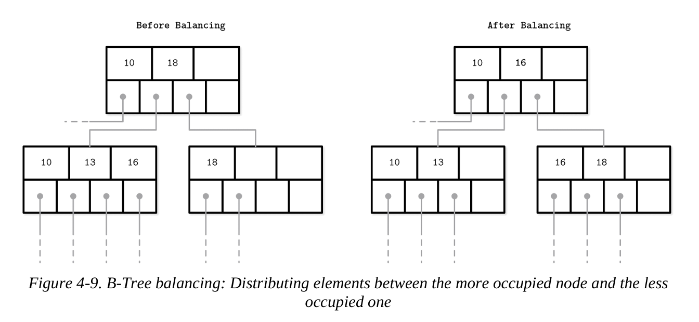
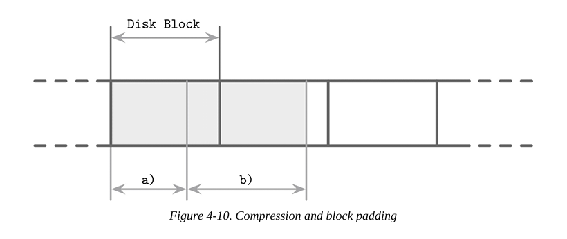
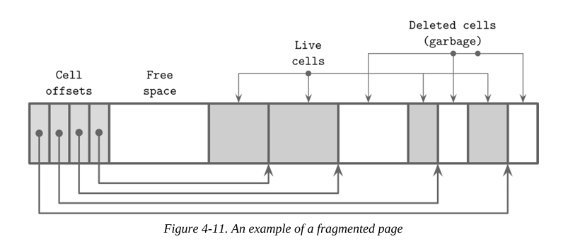

# 고급 백엔드 스터디 7주차

## Chapter 4. Implementing B-Trees

### Rebalancing

단순히 삽입/삭제할 때마다 바로 분할이나 병합을 하지 않고, 최대한 지연시켜 전체적인 트리의 구조 변경 비용을 줄이는 것이 핵심 전략이다.

- Rebalancing with a level: 같은 깊이(레벨)에 있는 노드들끼리 데이터를 나누는 방식이다. 
    - 예: 왼쪽 노드는 90%이상 차 있고, 오른쪽은 30%라면, 데이터를 오른쪽으로 조금 이동시켜 균형을 맞추는 것이다. 

- 이점:
    - 노드 점유율(node occupancy) 향상: 한 노드가 너무 차거나 너무 비는 것을 방지해 공간 낭비를 줄인다.
    - 트리 높이 감소 가능성: 너무 자주 노드를 분할하면 트리의 레벨이 깊어지는데, 이를 지연하면 구조적으로 더 평평한 트리를 유지할 수 있다.

- 단점:
    - 재조정(rebalancing) 유지비용 증가: 노드 간 데이터를 이동시키는 작업이 자주 발생하고 복잡해질 수 있다.

예를 들어 설명하자면, 이 전략은 이삿짐을 바로 정리하지 않고, 공간이 부족해질 때까지 기다렸다가 정리하며 수납 위치를 최적화 하려는 방식과 유사하다. 
분할/병합은 곧 이삿짐 추가 혹은 창고 분할인 셈이다.

- 로드 밸런싱(load balancing): 일반적으로 시스템의 부하를 고르게 분산시키는 개념이지만, 여기서는 트리의 노드들 사이에 데이터를 균형 있게 나누는 작업을 의미한다. 

- 삽입 시 로드 밸런싱:
    - 노드에 공간이 없을 때, 기존 방식은 바로 분할(split).
    - 하지만 여기선 형제 노드에 여유가 있다면, 일부 데이터를 넘겨줘 공간을 확보한다.

- 삭제 시 로드 밸런싱:
    - 노드가 너무 비게 되면, 기존 방식은 병합(merge).
    - 하지만 여기선 형제 노드에 여유가 있다면, 거기서 데이터를 가져와 최소 점유율(보통 50%)를 맞춘다. 

- 공간 활용 향상: 이러한 방식은 트리 구조가 더 균형 있게 유지되며, 불필요한 분할/병합을 줄이고 디스크 I/O도 줄일 수 있다.

형제 노드들 간에 요소를 주고받는 방식으로 균형 조정이 이루어진다. 이러한 최적화는 특히 디스크 기반 B-Tree에서 매우 중요하며, 자주 일어나는 분할/병합 비용을 줄이고 성능을 향상시키는 데 큰 역할을 한다.

- B-Tree의 차별점:
    - 일반 B-Tree는 노드가 가득 차면 바로 분할하여 두 개의 반쯤 찬 노드를 만든다.
    - B*-Tree는 분할을 지연시키고, 이웃 노드로 데이터를 분산시킨다.
        - 그리고 두 노드가 가득 찼을 때, 이들을 세 개의 노드로 분할하며 각 노드를 약 2/3 정도 채우는 방식이다.
    
SQLite는 이 B*-Tree 방식의 구현을 사용하고 있으며, 이는 그만큼 실용성이 높다는 것을 의미한다.

- 장점:
    - 평균 점유율 증가: 디스크나 메모리의 공간 활용이 향상된다.
    - 트리 높이 감소: 같은 수의 요소를 더 적은 레벨로 표현 가능 -> 검색 속도 향상
    - 페이지 접근 수 감소: 디스크 I/O 또는 메모리 접근이 줄어든다.

- 단점:
    - 복잡한 로직 필요: 어떤 형제 노드와 언제 어떻게 분할할 지 관리하는 로직이 복잡해진다.
    - 추가 상태 추적 필요: 각 노드의 점유 상태를 주기적으로 체크하고 반응해야 한다.

그림 4-9는 왼쪽 형제 노드보다 오른쪽 형제 노드가 더 많은 요소를 포함하고 있을 때, 이웃 노드 간에 요소를 분배하는 과정을 보여준다. 더 많이 채워진 노드에서 덜 채워진 노드로 요소들이 이동된다. 

- min/max invariant란?
    - 트리 자료구조에서 각 노드가 관리하는 키의 범위가 일정해야 한다는 불변 조건을 의미한다.
    - 부모 노드의 각 포인터(자식에 대한 참조)는 특정 키 범위(min~max)를 담당한다.
    - 이 범위를 유지함으로써 트리가 검색 가능한 상태를 유지하게 된다.
    - 예를 들어, 부모가 [50], 왼쪽 자식이 [10, 20, 30], 오른쪽 자식이 [60, 70]이라고 하자.
        - 왼쪽 자식은 부모 노드 50보다 작은 값, 오른쪽은 큰 값이다. 이 구조가 min/max invariant이다.
        - 여기서 만약 40을 넣는데, 왼쪽이 너무 가득 차서 40을 오른쪽 자식으로 옮길려고 하면 문제가 생긴다. 50보다 작은 40이 오른쪽으로 가기 때문이다.
            - 이를 해결하려면 부모 노드를 50이 아닌 40으로 업데이트 해야 한다. 
            - 즉, 자식 노드 간에 키를 이동했다면, 부모 노드의 기준 키도 새 범위에 맞게 갱신해야 한다.

노드 간 데이터 이동은 불변 조건을 깨뜨릴 수 있으므로, 부모 노드의 키를 반드시 업데이트해야 한다. 
이것이 바로 트리 전체의 정합성과 검색 정확성을 유지하는 핵심이다.

로드 밸런싱은 데이터베이스 구현에서 사용되는 유용한 기법이다. SQLite는 이 절에서 설명한 내용과 어느정도 유사한 balance-siblings 알고리즘을 구현하고 있다. 로드 밸런싱은 코드에 일부 복잡성을 추가할 수 있지만, 그 사용 사례가 한정적이므로 이후 단계에서 최적화 형태로 구현될 수 있다. 

### Right-Only Appends

- 단조 증가 키(monotonically increasing keys):
    - 예: 1, 2, 3, ...처럼 계속 증가하는 키 값
    - 자동 증가 또는 타임 스태프 기반 키 등이 여기에 해당한다.

- 오른쪽 끝 삽입 최적화:
    - 항상 가장 오른쪽 리프 노드에 삽입되므로 트리 전체를 순회하지 않고 빠르게 위치를 찾을 수 있다.
    - 분할도 오른쪽 끝에서만 주로 일어나므로, 트리의 다른 부분은 비교적 안정적으로 유지된다. 

- 비리프 노드(Non-leaf Node)의 단편화 감소:
    - 삽입 위치가 고정되어 있으므로 중간 노드들의 내용 변경이 적다.
    - 따라서 포인터와 키 값이 잘 유지되고, 디스크 상에서 조각화(fragmentation)가 덜 발생한다. 

- 이 구조의 장점:
    - 빠른 삽입 성능
    - 낮은 유지 비용 (덜한 재조정, 재정렬)
    - 페이지 캐시 효율성 증가: 오른쪽 끝 리프는 자주 접근되므로 캐시에 남아 있을 가능성이 높다. 

이러한 단조 증가 키 기반 설계는 많은 OLTP 시스템에서 쓰이며, 특히 시간 순 로그, ID 기반 테이블 등에서 큰 이점을 제공한다. 

PostgreSQL은 이 경우를 fastpath라고 한다.

- fastpath란?
    - 일반적인 트리 삽입에서는 루트부터 리프까지 경로를 따라 탐색(read path)을 수행한다.
    - 하지만 이 경우에는 탐색을 생략하고 바로 삽입이 가능하므로 매우 빠르게 처리된다. -> 그래서 빠른 경로(fastpath)라고 부른다.
    - 조건 요약:
        1. 삽입 키가 오른쪽 끝 리프의 첫 번째보다 크다 -> 단조 증가 보장
        2. 해당 리프 페이지에 공간이 남아 있다.
        3. 오른쪽 끝 페이지가 캐시에 올라와 있다. -> 디스크 I/O 없다.
    - 성과적 이점:
        - 읽기 경로 건너뛰므로, 루트부터 리프까지 탐색하는 비용이 절감된다. 
        - 캐시 활용: 리프 노드가 자주 쓰이므로 메모리에 이미 올라와 있는 경우가 많다.
        - I/O 감소, 속도 향상

SQLite도 이와 유사한 개념을 갖고 있다. 이를 quickbalance라고 부른다. 

- SQLite의 quickbalance란?
    - PostgreSQL의 fastpath와 유사하지만, 분할 대신 새 페이지 할당 방식을 사용한다.
    - 삽입하려는 키가 가장 큰 값이고, 오른쪽 끝 노드가 가득 찬 경우에 적용된다.

- 기존 방식(일반 분할):
    - 노드가 가득 차면 -> 분할 수행 -> 새 노드 두 개로 나누고 50%씩 데이터 분산

- quickbalance 방식:
    - 분할하지 않고 그냥 새로운 오른쪽 리프 노드를 하나 더 만들어 연결한다.
    - 부모 노드에 새로운 자식 노드 포인터를 추가한다. 

- 장점:
    - 분할에 따른 재조정 없이 빠르게 처리한다.
    - 삽입 키가 계속 커진다는 전제 하에, 새 노드는 금방 채워진다. 
    - 디스크 페이지를 자주 쪼개는 것보다 효율적이다. 

- 단점:
    - 새 페이지는 처음엔 거의 비어 있다. -> 공간 낭비 우려
    - 하지만 데이터 흐름이 오른쪽으로 지속된다면 결국 다시 효율적이게 된다. 

SQLite의 quickbalance는 fastpath와 비슷한 목적(빠른 오른쪽 삽입 처리)을 갖지만, 분할이 아닌 새 페이지 추가라는 점이 핵심 차별점이다. 

#### Bulk Loading

데이터가 1, 2, 3, 4, 5, ... 같은 순서로 이미 정렬되어 있는 경우를 생각해보자.
이를 일괄 로드(bulk load)하거나, 트리를 재구성(Rebuild)해야 하는 경우, 오른쪽에만 삽입하는 아이디어를 더욱 확장할 수 있다. 

- 최적화 전략:
    - 데이터를 일일이 탐색하여 삽입 위치를 찾지 않고,
    - 항상 트리의 오른쪽 끝 리프 노드에만 삽입하면 된다.

- 이점:
    - 트리 탐색을 생략할 수 있다.(매번 오른쪽만 사용)
    - I/O 최소화 및 성능 극대화
    - 디스크 정렬 상태도 더 깔끔하게 유지 가능

- 하향식(traditional insert) vs 상향식(bottom-up) 구성:
    - 일반적인 B-Tree 삽입은 데이터를 하나씩 추가하면서 위에서 아래로 구조를 조정하는 방식이다. -> 분할/병합 필요
    - 여기서는 데이터가 이미 정렬되어 있으므로, 트리를 아래에서 위로, 차례대로 미리 구성할 수 있다.

- 구성 방식:
    1. 먼저 리프 노드들을 생성하여 디스크에 쓴다.
    2. 리프 노드들의 포인터가 모이면 그걸 바탕으로 부모 노드를 생성한다.
    3. 이 과정을 반복하여 루트까지 도달한다.

- 장점:
    - split/merge 불필요: 삽입 중 구조 변경이 필요 없기 때문이다.
    - 쓰기 효율 극대화: 각 노드를 한 번에 쓰고, 다시 수정하지 않는다.
    - 트리의 정렬성과 공간 활용도 극대화

이는 마치 빌딩을 지을 때 벽돌을 하나하나 추가해가며 구조를 바꾸는 것이 아니라, 각 층을 미리 만들고 그 위에 차례대로 쌓아 올리는 방식이다. 계획된 구조이기 때문에 불필요한 재작업이 없다. 

- 일괄 로딩(bulk loading): 대량의 정렬된 데이터를 기존 트리에 하나씩 삽입하지 않고, 트리를 아래에서 위로 직접 구성하는 방식이다.

- 페이지 단위 leaf 작성: 개별 키를 삽입하지 않고, 정렬된 키들을 한 페이지 단위로 묶어서 리프 노드에 쓴다. 

- 첫 키만 부모에 전달: 각 리프 노드에서 가장 첫 번째 키만 상위 부모 노드에 올려 보낸다. 이 키는 부모가 자식 노드를 구분할 때 기준이 되는 분기 키(split key) 역할을 한다.

- 상위 레벨 구성 방식:
    - 하위 노드를 다 채운 후, 부모 노드를 구성하는 것은 기존 B-Tree 생성 알고리즘과 동일하다.

- 오른쪽 끝 분할만 발생: 키들이 정렬된 상태로 삽입되므로, 공간이 부족해 새 노드를 만드는 일이 있더라고 항상 **가장 오른쪽에서만 분할**이 일어난다.

이 방식은 데이터를 정렬한 후 트리를 생성하거나 다시 구성할 때 매우 효율적이며, 쓸데없는 재정렬이나 탐색을 생략할 수 있는 큰 장점이 있다. 

- 장점 1: 디스크에서 split/merge 불필요
    - 삽입 중간에 노드가 꽉 차는 일이 없기 때문에,
    - 기존 B-Tree 삽입처럼 분할이나 병합이 일어나지 않는다.
    - 디스크 I/O 감소, 로직 단순화

- 장점 2: 메모리 사용 최소화
    - 트리를 위로 올라가며 만들기 때문에, 현재 작성 중인 리프 노드의 부모들만 메모리에 있으면 충분하다.
    - 전체 트리를 메모리에 올릴 필요가 없다. 대용량 트리 생성에 적합하다.

불변(Immutable) B-Tree는 동일한 방식으로 생성할 수 있지만, 가변(mutable) B-Tree와는 달리 이후 수정에 대한 공간 오버헤드가 필요하지 않다.

- 불변 B-Tree:
    - 생성된 이후에는 수정이 불가능한 트리
    - 예: 읽기 전용 인덱스, 또는 버전 관리된 구조

- 수정 불필요 -> 공간 오버헤드 없음:
    - 가변 B-Tree는 삽입/삭제가 자주 일어나므로 분할 여유 공간, 균형 조정용 빈 공간 등을 남겨둬야 한다.
    - 하지만 불변 트리는 수정이 없으므로, 그런 공간을 남겨둘 필요가 없다.

- 모든 페이지를 가득 채울 수 있다. 
    - 불편 트리는 페이지를 100%에 가깝게 꽉 채워서 저장 가능하다.
    - 디스크 공간 활용 극대화 + 더 적은 페이지로 같은 데이터를 표현

- 성능 향상:
    - 높이가 낮은 트리 -> 더 빠른 탐색
    - 더 적은 디스크 접근 -> 더 나은 I/O 성능

### Compression

- 압축 필요성:
    - 원시(raw) 데이터는 저장 공간을 많이 차지한다.
    - 특히 디스크 기반 시스템에서 저장/전송 비용이 크다.
    - 공간 절약을 위한 압축이 중요하다.

- 압축의 tradeoff:
    - 압축률이 높을수록 저장 공간 절약, 더 많은 데이터를 한 번에 읽을 수 있다.
    - 하지만 압축 해제(decompression)에 CPU와 RAM 사용량이 증가한다.

- 예시로 이해하기:
    - 압축률이 높은 파일 하나를 읽는 건 빠를 수 있다.(I/O 절감)
    - 하지만 그걸 해석(복원)하려면 CPU가 열심히 일해야 한다. -> 처리 지연 가능성

- 데이터베이스 설계 시 고려점:
    - 읽기 성능 중심이면 압축률을 낮게 설정하거나 압축을 안쓸 수도 있다.
    - 저장 공간이 중요하거나 읽기 패턴 예측이 가능하면 높은 압축률이 유리하다.

압축은 다양한 세분화 수준에서 수행될 수 있다. 

- 압축의 세분화 수준(granularity):
    - 예: 파일 단위, 블록 단위, 페이지 단위, 레코드 단위 등
    - 세분화가 클수록(즉, 범위가 작을 수록) 업데이트/접근이 유연해진다.

- 파일 전체 압축의 문제점:
    - 압축률은 좋지만, 데이터 일부를 수정하면 전체를 다시 압축해야 한다.
    - 데이터 변경이 빈번한 시스템에는 비효율적이다.

- 인덱스 파일 압축이 어려운 이유:
    - 인덱스는 페이지 단위 랜덤 접근이 핵심이다.
    - 파일 전체를 압축하면, 특정 페이지를 찾기 위해 전체 압축된 덩어리를 해제해야 하는 문제가 발생한다.
    - 이는 I/O 낭비, CPU 낭비, 비효율이다.
    - 현실적인 대안:
        - 페이지 단위 압축(page-wise compression):
            - 각 페이지를 독립적으로 압축 -> 압축 해제나 접근 시 다른 페이지에 영향을 주지 않는다.
            - 디스크 페이지 로딩/쓰기(flush) 과정과 연계하기 적합하다.

즉, 압축은 압축률과 접근 효율 사이의 균형을 고려해야 하며, 특히 인덱스처럼 임의 접근(random access)이 중요한 구조에서는 세분화된 압축 전략이 필요하다.

그림 4-10을 보면 압축된 페이지 (a)가 디스크 블록보다 적은 공간을 차지하는 것을 볼 수 있다. 이 페이지를 로드할 때, 다른 페이지에 속한 추가 바이트도 함께 로딩된다. 반면 (b)처럼 여러 디스크 블록에 걸쳐 있는 페이지의 경우, 추가 블록을 읽어야 한다.

또 다른 접근 방식은 데이터 자체만을 압축하는 것으로, 행 단위(전체 데이터 레코드를 압축) 또는 열 단위(열을 개별적으로 압축) 방식이 있다.

- 행 단위 압축(row-wise compression):
    - 하나의 데이터 레코드를 통째로 압축
    - 예: {id: 1, name: "Alice", age: 25} -> 하나의 덩어리로 압축
    - 구조가 고정되어 있고, 행 단위 접근이 많을 때 유리

- 열 단위 압축(column-wise compression):
    - 열 하나씩 따로 압축
    - 예: "Alice", "Bob", "Charlie" 이름들만 따로 모아 압축
    - 동일한 타입/패턴의 값이 반복될 때 압축률이 높다.
    - 분석용 쿼리, 칼럼 기반 스토리지에 적합

- 페이지 관리와 압축의 분리:
    - 페이지는 여전히 디스크 블록 단위로 처리하지만,
    - 그 안의 데이터 압축은 독립적으로 수행한다.
    - I/O 관리와 압축을 유연하게 조절이 가능하다.

- 플러그형 압축 라이브러리 사용:
    - 오픈소스 DB들은 다양한 압축 방식을 지원한다.
    - Snappy: 빠른 속도 중심
    - zLib: 안정성과 범용성
    - lz4: 매우 빠른 압축/해제 속도
    - 사용자가 목적에 따라 압축 엔진을 선택 가능

압축 알고리즘은 데이터셋과 목표(예: 압축률, 성능, 메모리 오버헤드)에 따라 서로 다른 결과를 내기 때문에, 이 책에서는 알고리즘 비교나 구현 세부 사항에 대해선 다루지 않는다.
다양한 블록 크기에 대해 여러 압축 알고리즘을 평가한 개요 자료들이 많이 있으며(예: Squash Compression Benchmark), 보통 네 가지 지표에 중점을 둔다.

- 네 가지 주요 평가 지표:
    1. Memory Overhead: 압축 과정 중 사용하는 RAM
    2. Compression Performance: 압축 속도
    3. Decompression Performance: 압축 해제 속도
    4. Compression Ratio: 얼마나 압축 됐는지(원본 대비 크기 비율)

### Vacuum and Maintenance

지금까지는 주로 B-Tree에서 사용자에게 노출되는 연산에 대해 다뤘다. 하지만 쿼리와 병렬로 실행되면서 저장소의 무결성을 유지하고, 공간을 회수하며, 오버헤드를 줄이고, 페이지 정렬을 유지하는 다른 프로세스들도 존재한다. 이러한 작업들을 백그라운드에서 수행하면, 삽입, 갱신, 삭제 중에 정리 작업의 비요을 지불하지 않아도 되므로 시간을 절약할 수 있다.

- 슬록 방식 페이지(slotted page):
    - 각 레코드(셀)의 시작 위치를 포인터 배열로 관리
    - 삽입/삭제/갱신이 많을 수록 내부 공간이 어지럽혀지기 쉽다.

- 단편화(fragmentation) 문제:
    - 논리적으로는 여유 공간이 있다.(전체 여유 바이트 수 기준)
    - 그러나 그 공간이 조각나 있다. -> 새로운 데이터를 넣을 수 없거나, 느려졌다.
    - 예: 삽입할 레코드 크기 = 100B, 남은 공간 총합 = 150B -> 조각나 있어서 실제 삽입이 불가능하다.

- 그림 4-11 설명:
    - 삭제된 두 레코드 자리에 가비지 공간이 남아 있고, 
    - 셀 포인터와 실제 데이터 사이에도 작은 여유 공간이 따로 존재한다.
    - 전체로 보면 여유 있지만, 연속된 공간이 없어서 문제가 발생한다. 

슬롯 기반 페이지는 유연하지만, 삭제와 갱신이 많아지면 단편화가 생겨 실제 공간 활용에 제약이 생기며, 이를 방지하기 위해 주기적인 정리 작업이 필요하다.

- B-Tree 탐색 원리:
    - 항상 루트에서부터 자식 포인터를 따라 리프까지 탐색
    - 이 경로에 포함된 레코드만이 "도달 가능한 데이터" -> 유효 데이터
- live(addressable) vs garbage(nonaddressable):
    - addressable: 루트로부터 경로를 따라 도달 가능한 상태 -> 유효 데이터
    - nonaddressable: 어떤 노드에서도 참조되지 않는 데이터 -> 사실상 삭제된 상태

B-Tree에서 루트로부터 도달할 수 없는 데이터는 죽은 데이터이며, 이런 가비지 레코드들은 정리 대상이 되어야 한다. 이는 저장소 무결성과 공간 회수 전략의 핵심 전제이다.

그림 4-11에서 이러한 구분을 확인활 수 있다. 여전히 포인터가 연결되어 있는 셀들은 참조 가능(addressable)하며, 삭제되었거나 덮어쓰여진 셀들과는 다르다. 가비지 영역을 0으로 채우는 작업(zero-filling)은 성능상의 이유로 종종 생략된다. 어차피 이 영역은 나중에 새로운 데이터로 덮어쓰이기 때문이다. 

#### Fragementation Caused by Updates and Deletes

