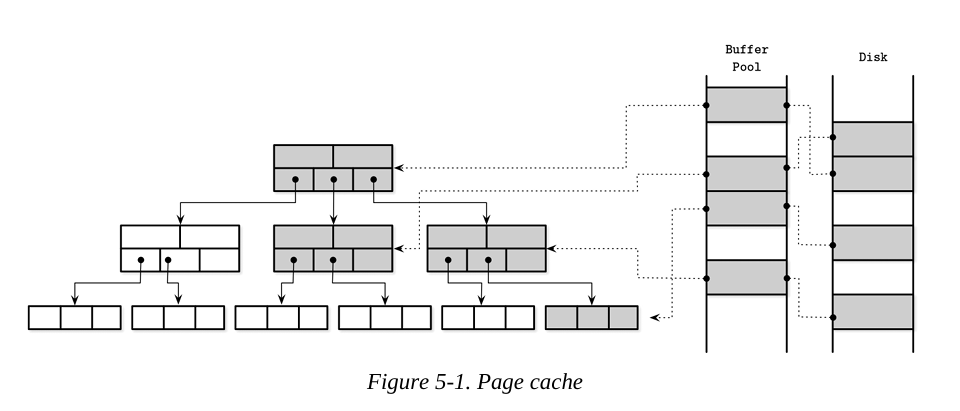

# 고급 백엔드 스터디 8주차

# Chapter 5. Transaction Processing and Recovery

이 책에서는 데이터베이스 시스템 개념을 하향식이 아닌 상향식 접근 방식으로 다뤄왔다.
저장 구조(storage structures)에 대해 배웠고, 버퍼 관리(buffer management), 락 관리(lock management), 복구(recovery)와 같은 상위 컴포넌트를 배울 준비가 됐다.

- 트랜잭션(Transaction):
    - 데이터베이스 관리 시스템에서 더 이상 나눌 수 없는 논리적 작업 단위
    - 여러 연산을 하나의 단계로 표현
    - 논리적 작업 단위 묶음
    - 예: 계좌 이체 -> 출금 + 입금 = 한 트랜잭션
    - 트랜잭션의 목적:
        - 여러 작업을 하나처럼 처리해서 데이터 정합성과 안정성을 보장

데이터베이스 트랜잭션은 ACID를 보장해야 한다.

- ACID 속성:
    1. Atomicity(원자성):
        - 트랜잭션 내의 모든 연산은 반드시 모두 성공하거나, 모두 실패해야 한다. 부분적으로 적용되서는 안된다.
        - 각각의 트랜잭션은 커밋(commit) 하여 실행 중 이루어진 모든 쓰기 연산의 변경 사항을 외부에 보이도록 만들거나, 중단(abort) 하여 아직 외부에 노출되지 않은 모든 부작용을 롤백(되돌림)할 수 있다.
        - 커밋은 최종 연산이다. 중단된 트랜잭션은 재시도될 수 있다.
    2. Consistency(일관성): 
        - 트랜잭션 전후로 DB의 상태가 유효해야 한다.
        - 애플리케이션에 특화된 보장으로, 하나의 트랜잭션은 데이터베이스를 하나의 유효한 상태에서 다른 유효한 상태로만 전이시켜야 한다.
        - 제약조건, 참조 무결성 등의 데이터베이스 불변식을 항상 유지해야 한다. 
        - 일관성은 ACID 속성 중 가장 약하게 정의된 특성이며, 이는 데이터베이스 자체가 아니라 사용자가 제어하는 요소이기 때문이다.
    3. Isolation(고립성):
        - 동시에 실행되는 트랜잭션끼리 서로 간섭하지 않는다.
        - 고립성은 변경 사항이 언제 보이게 되는지, 그리고 어떤 변경이 다른 트랜잭션에 보일 수 있는지를 정의한다.
        - 많은 DB는 성능 상의 이유로 이 정의보다 약한 격리 수준을 사용한다. 
        - 어떤 동시성 제어 방식이 사용되는 지에 따라, 하나의 트랜잭션이 수행한 변경 사항이 다른 트랜잭션에 보일 수도 있고, 아닐 수도 있다. 
    4. Durability(지속성):
        - 일단 커밋된 트랜잭션은 디스크에 영구히 보존되어야 한다.
        - 정전, 시스템 오류, 장애 발생 이후에도 유지되어야 한다.

디스크에 데이터를 조직화하고 영구적으로 저장하는 저장 구조 외에도, 데이터베이스 시스템에서 트랜잭션을 구현하려면 여러 구성 요소들이 함께 작동해야 한다. 노드 내에서는 트랜잭션 관리자(transaction manager)가 트랜잭션과 그 개별 단계들을 조정하고, 스케줄링하며, 추적하는 역할을 수행한다. 

- 락 관리자(lock manager)의 역할:
    - 데이터 무결성 보장: 동시에 여러 트랜잭션이 같은 데이터를 수정하려는 경우 충돌 방지
    - 접근 제어: 누가 어떤 자원에 접근할 수 있는 지를 제어

- 락 종류:
    - 공유 락(shared lock): 여러 트랜잭션이 동시에 읽기 가능
    - 전용 락(exclusive lock): 한 트랜잭션이 읽기/쓰기 가능

- 락 요청 처리 과정:
    1. 트랜잭션이 락 요청
    2. 락 관리자가 현재 보유 상태를 확인
    3. 충돌 없으면 즉시 허용, 충돌 시 대기 or 중단 후 재시도

- 락 해제 시 동작:
    - 락이 해제되었거나 트랜잭션이 종료되면,
    - 대기열에 있는 다음 트랜잭션에게 락을 부여하고 알린다.

- **페이지 캐시(page cache)**란?
    - 디스크에서 데이터를 직접 읽고 쓰는 대신, 메모리에 임시로 저장하여 빠르게 접근할 수 있게 해주는 중간 계층 캐시
    - 주요 기능:
        1. 변경 사항 임시 보관: 트랜잭션이 데이터를 수정하면, 디스크에 바로 쓰지 않고 캐시 페이지에 먼저 반영
        2. 성능 향상: 메모리 접근은 디스크보다 훨씬 빠르므로, 읽기/쓰기 성능 대폭 개선
        3. 비동기적 디스크 반영: 일정 시점에만 디스크로 동기화 -> 효율적으로 디스크 I/O 가능
        - 동기화되지 않은 상태란?
            - 페이지는 메모리에서 최신 상태지만, 디스크에는 아직 반영이 안된 상태이다.
            - 이때 장애 발생하면 손실 위험이 있으므로 -> 복구 로그(WAL 등)와 함께 사용한다. 

- 로그 관리자(log manager):
    - 변경 이력 기록자: 디스크에 쓰기 전, 캐시에 적용된 변경 내용을 먼저 로그에 기록한다.
    - 이를 통해 충돌(crash) 후에도 데이터 복구 가능

- 로그의 두 가지 용도:
    1. REDO: 시스템 재시작 시 로그를 읽어 최근 변경을 다시 적용
    2. UNDO: 중단(abort)된 트랜잭션의 변경 사항은 되돌리기

- 왜 로그가 먼저 쓰여야 할까?
    - 변경 사항을 디스크에 반영하기 전에 로그로 기록해두면,
    - 충돌 후에도 정확한 상태 복원 가능
    - 이를 WAL(Write-Ahead Logging)이라고 한다.

로그 관리는 데이터베이스의 신뢰성과 복구 가능성을 위한 핵심 장치로, 아직 디스크에 반영되지 않은 상태에서도 변경 사항의 복구와 취소를 가능하게 한다.

분산(다중 파티션) 트랜잭션은 추가적인 조정 작업과 원격 실행을 필요로 한다. 분산 트랜잭션 프로토콜에 대해서는 13장에서 다룬다.

## Buffer Management

- 대부분의 데이터베이스의 2단계 메모리 계층 구조:
    - 느리고 영속적인 디스크(저장소)
    - 빠르지만 휘발성인 메인 메모리(RAM)
    - -> 성능을 위해 디스크 데이터를 메모리에 캐싱해서 사용

- 페이지 캐시:
    - 자주 사용하는 페이지는 메모리에 저장해두고 재사용
    - 디스크 읽기 성능을 대폭 향상시킨다.
    - 메모리에 없을 때만 디스크에서 실제로 읽는다

메모리에 존재하는 캐시된 페이지들은 디스크의 데이터가 다른 프로세스에 의해 수정되지 않았다는 가정 하에 재사용될 수 있다. 이러한 접근 방식은 '가상 디스크(virtual disk)'라고도 불리며, 이는 메모리에 페이지 복사본이 없을 때에만 실제 저장 장치에 접근한다는 개념이다. 보다 일반적인 명칭은 페이지 캐시(Page Cache) 혹은 버퍼 풀(buffer pool)이다.

- 주의사항:
    - 캐시는 휘발성이므로, 시스템이 비정상적으로 종료되면 캐시된 페이지는 모두 손실된다. 
    - -> 로그 매니저 등 다른 장치와 함께 작동하여 데이터 복구를 보장해야 한다.

- Page Cache와 Buffer Pool의 차이:
    - Page Cache: 디스크 페이지 자체를 메모리에 보관하고 공유하며 재사용하는 목적이 뚜렷하다.
    - Buffer Pool: 단순히 빈 버퍼를 사용하는 풀(Pool)같은 뉘앙스, 기능 중 일부만 반영

교재에서는 정확한 의미 전달을 위해 "페이지 캐시" 용어를 기본으로 사용한다.

- 운영 체제에서의 페이지 캐시:
    - 데이터베이스 뿐만 아니라 운영 체제도 메모리를 디스크 캐시로 사용한다.
    - 예: 리눅스의 free 명령에서 'cached' 영역이 바로 이 부분이다.
    - I/O syscall (read/write)의 성능을 높이기 위해, 자주 접근하는 파일 블록을 메모리에 캐싱

- Page In:
    - 디스크에 있는 페이지를 메모리(페이지 캐시)로 로드하는 과정
    - -> 캐시 미스 시 발생

- Dirty Page:
    - 캐시된 페이지에 변경이 가해졌지만 아직 디스크에 반영되지 않은 상태
    - 이러한 페이지는 flush 작업을 통해 디스크에 동기화된다.
    
- Page Cache 한계:
    - 메모리는 제한적이므로 전체 DB를 다 올릴 수는 없다.
    - 따라서 LRU(최저 사용 우선 제거) 등 정책으로 기존 페이지를 선택적으로 제거(eviction)한다.

- 그림 5-1 설명:
    - 그림 5-1은 B-Tree 페이지의 논리적 표현, 이들의 캐시된 버전, 그리고 디스크 상의 페이지들 간의 관계를 볼 수 있다. 페이지 캐시는 자유 슬롯에 페이지를 비순차적으로 로드하므로, 디스크에서의 페이지 순서와 메모리에서의 순서 간에는 직접적인 매핑 관계가 존재하지 않는다.

- 페이지 캐시의 주요 기능 요약:
    1. 캐시 유지: 자주 쓰는 페이지를 메모리에 저장하여 빠른 접근 제공
    2. 수정 버퍼링: 디스크에 바로 쓰지 않고 캐시에 먼저 수정, 나중에 디스크 반영
    3. 페이지 인(Page-in): 필요 시 디스크에서 페이지를 메모리에 로딩
    4. 캐시된 페이지 즉시 반환: 메모리에 있으면 디스크 접근을 생략하고 바로 반환한다. 
    5. Eviction + Flush: 공간 부족 시, 사용 빈도 낮은 페이지 제거 + 디스크에 저장

- 커널 페이지 캐시 우회:
    - O_DIRECT 사용 배경:
        - 커널 페이지 캐시를 우회하여 DB가 직접 버퍼를 관리할 수 있게 한다.
        - 중복된 캐시 관리 방지, 성능 제어 향상
    - 운영 체제 관점에서의 우려:
        - 비동기 처리가 안되어 있다(async I/O 부재).
        - readahead(미리 읽기) 등의 힌트를 커널에 제공할 수 없다. 
        - 리누스 토발즈도 이 점에서 O_DIRECT가 비효율적이라고 비판하였다.
    - 대안적 방법:
        - fadvise로 커널에 페이지 캐시 퇴출 정책에 대한 의견 전달 가능(하지만 경쟁력이 없다.)
        - memory mapping(mmap): syscall 없이 직접 메모리 접근 가능하지만 캐싱 제어권 손실

O_DIRECT는 커널을 거치지 않고 DB가 직접 디스크와 메모리를 관리하는 방식으로, 성능과 일관성에 유리하지만 OS 차원의 최적화 기능을 사용할 수 없다는 단점도 존재한다. OS 지원이 충분하지 않는 한, O_DIRECT는 실용적인 선택지이다.

### Caching Semantics

- 단방향 동기화:
    - 캐시된 내용은 메모리 -> 디스크 방향으로만 이동
    - 다른 프로세스는 백업 파일(backing file)에 변경을 가할 수 없기 때문에, 디스크의 내용이 메모리에 반영되는 것은 수동적이다.

- 애플리케이션 전용 캐시란?
    - 운영체제의 커널 페이지 캐시처럼 동작하지만, DB 엔진이 직접 디스크를 제어한다. 
    - 논리적 쓰기 연산을 디스크의 실제 물리 쓰기와 분리한다. -> 쓰기 병합, 지연 처리 등 최적화 가능
- 장점:
    - 별도의 알고리즘 변경 없이도 트리 구조의 일부를 메모리에 올려 성능 향상
    - 디스크 호출을 페이지 캐시 호출로만 바꾸면, 기존 알고리즘 그대로 사용 가능

- 페이지 접근 흐름 요약:
    1. 페이지 요청 시작:
        - 스토리지 엔진이 어떤 페이지(P)를 필요로 한다.
        - 이 페이지는 특정 논리 주소 또는 페이지 번호로 식별된다. 
    2. 캐시 적중 여부 확인(Page Cache Lookup):
        - 메모리에 있다면 -> 캐시 적중(Hit): 즉시 해당 페이지 반환
        - 메모리에 없다면 -> 캐시 미스(Miss): 다음 단계로 진행
    3. 페이지 로딩(Page-In):
        - 캐시에 없을 경우:
            - 논리 주소 -> 물리 주소로 페이지 위치를 변환
            - 디스크에서 해당 페이지의 내용을 메모리로 읽어온다.(Page-In)
    4. 버퍼 참조 처리:
        - 읽어온 페이지는 캐시 내의 버퍼에 저장되고, 이 버퍼는 이제 "참조된 상태(referenced)"
        - 이 페이지를 사용하는 동안:
            - 스토리지 엔진은 이 버퍼를 수정 가능 또는 읽기 전용으로 사용
            - 사용이 끝난 후 반드시:
                - 참조 해제(dereference) 하거나
                - 버퍼를 반환하여 페이지 캐시가 재사용 가능하게 해야 한다.
    5. 페이지 수정 시 처리(Dirty Page):
        - 만약 이 페이지에 수정이 발생했다면:
            - 예: 셀 추가, 값 변경 등
            - 해당 페이지는 더티(dirty) 상태로 표시된다.
            - 더티 플래그는 "디스크와 메모리 상태가 불일치"함을 의미
    6. 고정(Pinning) 옵션:
        - 이 페이지가 반드시 캐시에 유지되어야 한다면, "pin" 처리를 할 수 있다. 
            - 예: 루트 노드처럼 자주 접근되는 페이지
        - 핀 된 페이지는 evict(제거)되지 않는다.

### Cache Eviction

- 케시 유지의 장점:
    - 디스크 접근 없이 더 많은 읽기 처리가 가능
    - 동일 페이지에 대한 여러 쓰기를 묶어서 버퍼링 -> 효율적

- Eviction의 필요성:
    - 캐시 용량은 한정적 -> 공간이 부족하면 페이지 제거 필요
    - 제거 기준:
        - 디스크와 동기화된 상태(플러시 완료 또는 미수정)
        - 참조 중/고정되지 않은 페이지
    - 주의점:
        - Dirty 페이지는 반드시 플러시 후 제거 가능
        - **참조 중(referenced)**인 페이지는 사용 중이므로 절대 제거 금지
    - 성능 고려 사항:
        - 매번 eviction 시점마다 flush하면 I/O 과부하
        - 해결책 -> 백그라운드 플러셔 프로세스
            - 예상 제거 대상 dirty 페이지를 선제적으로 디스크에 기록
            - 예: PostgreSQL의 background flush writer

- 내구성(Durability):
    - DB가 충돌(crash) 하더라도, 커밋된 데이터는 반드시 보전되어야 한다.
    - 플러시되지 않은 데이터는 손실 대상이므로 -> 플러시가 필수이다.

- 체크포인트(Checkpoint) 프로세스의 역할:
    - WAL(Write-Ahead Log)와 Page Cache 사이의 동기화 담당
    - 캐시된 페이지가 플러시되었는지를 기준으로 WAL에서 로그 삭제 여부 결정

- 삭제 조건:
    - 특정 WAL 항목 -> 해당 변경이 플러시된 페이지에 적용된 것이라면 삭제 가능
    - 그렇지 않으면, 아직 디스크에 반영되지 않았으므로 삭제 불가

- 더티 페이지 Eviction 제한:
    - 체크포인트가 완료되기 전까지는 Dirty 페이지 제거 불가
    - 데이터 손실 방지를 위한 핵심 제약

이는 다음과 같은 여러 목표들 사이에 항상 tradeoff가 존재함을 의미한다.

- 다섯 가지 목표 및 상충 관계:
    1. 플러시 지연: 디스크 I/O를 줄이기 위한 목적, 너무 늦으면 데이터 손실 가능
    2. 사전 플러시: 제거 시점 전 미리 플러시 -> 즉시 제거 가능, 불필요한 디스크 접근 증가
    3. 최적 순서 선택: 어떤 페이지를 먼저 플러시/제거할지 판단, 복잡한 알고리즘 필요
    4. 캐시 메모리 제한: RAM 초과 방지, 너무 자주 플러시하거나 제거해야 할 수 있다.
    5. 데이터 손실 방지: 플러시 전 장애 발생 시 위험, 플러시를 너무 자주 하면 성능 하락

1~3은 성능 최적화 중심, 4~5는 안정성,자원 제약 중심이다. 결국은 균형이 핵심이다. 

### Locking Pages in Cache

